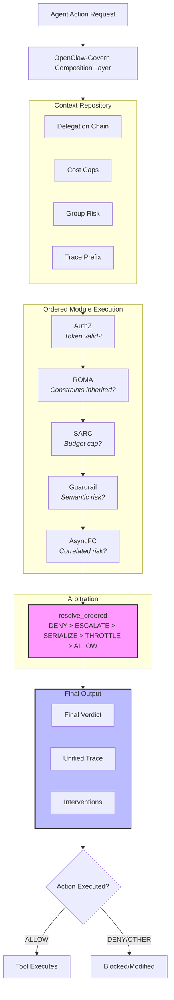

# OpenClaw-Govern Architecture

**Figure 1: OpenClaw-Govern Architecture.** Agent actions are intercepted by the composition layer, which executes governance modules in fixed order (AuthZ → ROMA → SARC → Guardrail → AsyncFC). Each module reads/writes to shared `GovernanceContext` and produces a verdict. The resolution function applies deterministic arbitration (DENY > ESCALATE > SERIALIZE > THROTTLE > ALLOW). Final verdict and unified trace are returned to the agent.

---

## Notes for Final Figure

For the actual paper submission, replace this Mermaid diagram with a vector graphic created in:
- **draw.io** (free, exports to SVG/PDF)
- **Lucidchart** (free tier available)
- **TikZ** (LaTeX-native, steep learning curve)
- **Excalidraw** (hand-drawn style, exports to SVG)

**Design recommendations:**
- Use consistent color scheme (e.g., blue for context, green for modules, orange for arbitration)
- Add callout boxes explaining key design decisions
- Include example module verdicts flowing through the pipeline
- Show trace tree construction on the right side